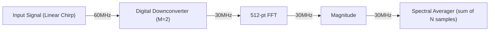

# Digital Spectrometer Project Tree
## Project Variables
- Fs --> ADC Sampling Frequency [Hz]
- FFT_N --> Length of FFT
- AVG_N --> Length of Spectral Averaging window (in samples)
- 
### Chirp Block (Simulated ADC) Parameters
- T --> Chirp signal length [seconds]
- f1 --> starting frequency [Hz]
- f2 --> ending frequency [Hz]
- Q --> Quantized Bit Resolution

### DDC Block Parameters
- LPF is fixed at 16 samples average
### FFT Block Parameters

### Magnitude Block Parameters

--- 
## Project Components
- Linear Chirp pulse of length T seconds from f1 [Hz] to f2 [Hz]

